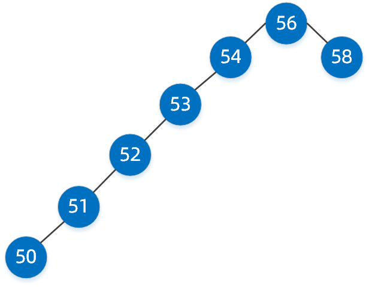

[TOC]

# 数据结构

## 跳表


```rust
   fn append(&mut self, offset: usize, data: String) {
        let level = if self.head.is_none() {
            self.max_level
        } else {
            self.get_level()
        };
        let node = Node::new(vec![None; level], data, offset);
        for i in 0..level {
            if let Some(old) = self.tails[i].take() {
                let next = &mut old.borrow_mut().next;
                next[i] = Some(node.clone());
            }
            self.tails[i] = Some(node.clone());
        }
        if self.head.is_none() {
            self.head = Some(node.clone())
        }
        self.length += 1;
    }
```

self.head 指向最下层的头部，叠在 head 上面的都是指针的复制 vec![None,level] 表示初始化了几层,

tails[self.max_level] 始终指向每层的最后。

```rust
 fn get_level(&self) -> usize {
        let mut n = 0;
        while random::<bool>() && n < self.max_level {
            n += 1;
        }
        n
    }
```

通过概率论的方法建立层数，概率上每层递归 /2

## 二叉树


若它的左子树不空，则左子树上所有结点的值均小于它的根节点的值； 若它的右子树不空，则右子树上所有结点的值均大于它的根结点的值.

极限偏移情况:

查找效率趋近于O(n),完美平衡树查找效率为 O(log(n))


## 红黑树

出现背景: 二叉极限偏移

优点:自平衡，趋向完美二叉

当执行删除，插入操作之后，红黑属性可能违规，恢复红黑属性需要O(log(n))的颜色变换，并且旋转不超过3次。

保证了插入，删除操作O(logn)次。

### 用途

1. linux 非实时调度任务，调度程序CFS，以虚拟运行时间作为key构建红黑树，根据所有任务占用的cpu状态来确定调度任务的优先级.
2. linux 虚拟存储区域（VMA）表示进程使用的虚拟空间，每个VMA是一段程序的连续虚拟空间，相似具有单元性，虚拟区域按照地址排列由指针构成链表。发生缺页中断的时候索引VMA到特定区域，次数频繁，使用红黑树减少查找时间。
3. 红黑树主要**优化索引**

## B树

出现背景:上述二叉搜索最好也是logn 效率，n表示树深度。

优点:降低树高度，适合大量数据（像任务调度这种数据量太小了...）

实际场景:大规模存储数据过程中递归树一层，抽象对下级数据库执行一次查找消耗IO查询次数一次，导致读写IO过于频繁。（小视角：外部存储器，磁盘寻道过程。）

发展过程：二叉启发，自然出现多路查找，多叉树出现。

B+树，存储值放在叶子节点，叶子节点之间链接，形成链表，就适合区间查找了。