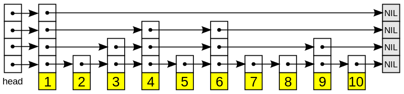

[TOC]

# 数据结构

## 跳表



```rust
   fn append(&mut self, offset: usize, data: String) {
        let level = if self.head.is_none() {
            self.max_level
        } else {
            self.get_level()
        };
        let node = Node::new(vec![None; level], data, offset);
        for i in 0..level {
            if let Some(old) = self.tails[i].take() {
                let next = &mut old.borrow_mut().next;
                next[i] = Some(node.clone());
            }
            self.tails[i] = Some(node.clone());
        }
        if self.head.is_none() {
            self.head = Some(node.clone())
        }
        self.length += 1;
    }
```

self.head 指向最下层的头部，跌在head上面的都是指针的复制 vec![None,level] 表示初始化了几层,

tails[self.max_level] 始终指向每层的最后。

```rust
 fn get_level(&self) -> usize {
        let mut n = 0;
        while random::<bool>() && n < self.max_level {
            n += 1;
        }
        n
    }
```

通过概率论的方法建立层数，概率上每层递归 /2


 